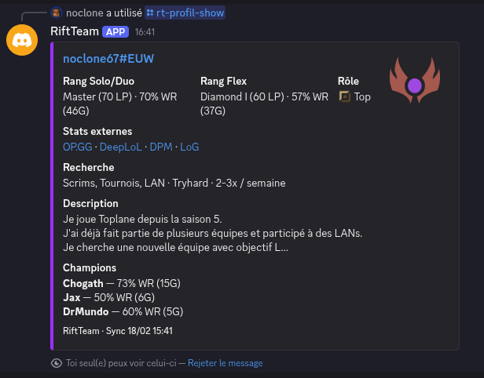
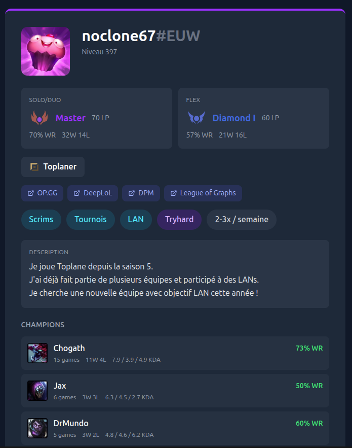
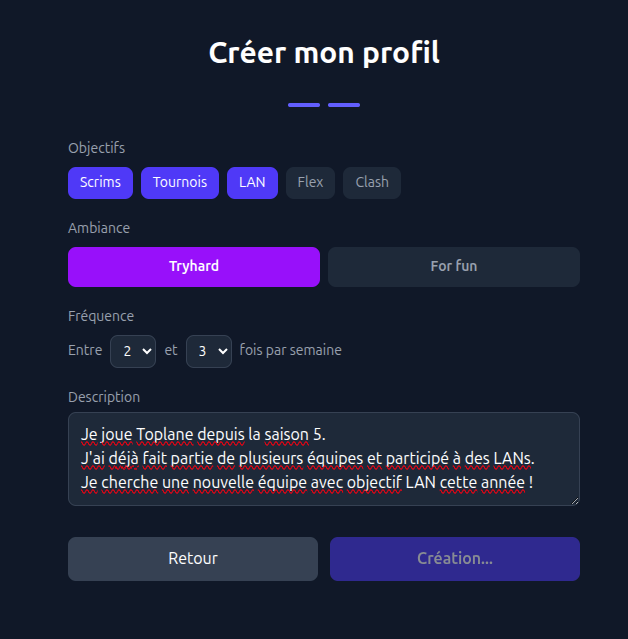
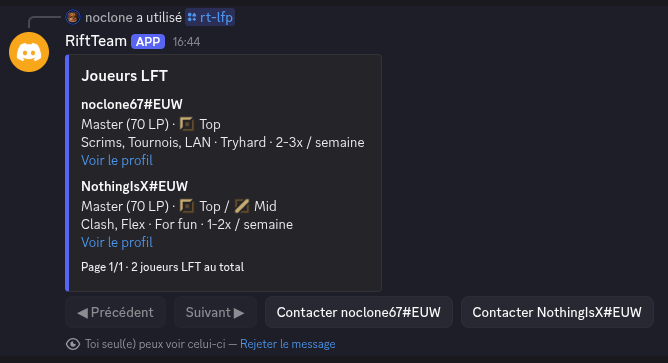
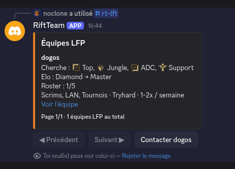
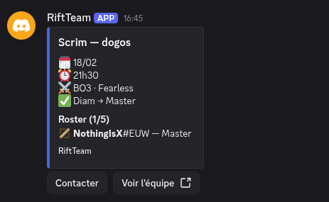
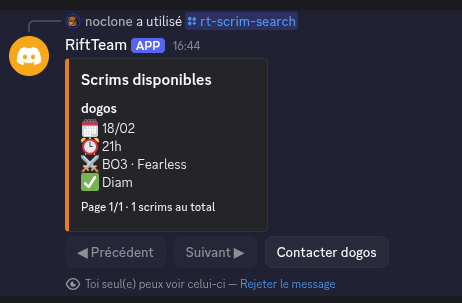

# RiftTeam

**Trouve ton équipe. Vérifie ton rang. Joue.**

RiftTeam est un bot Discord + site web qui aide les joueurs amateurs de League of Legends à trouver des équipes pour des scrims et du jeu compétitif. Conçu pour la **communauté francophone EUW**.

## Le problème

Un joueur qui cherche une équipe doit poster un message texte dans un channel Discord. Ce système a ses limites :

- Les messages sont enterrés en quelques heures
- Rien n'est vérifié — n'importe qui peut prétendre être Diamond
- Pas de standardisation, chacun met les infos qu'il veut
- Aucune mise à jour automatique

## Ce que RiftTeam fait

**Profil joueur vérifié via l'API Riot, créé en 60 secondes, partageable dans Discord.**

Le bot récupère automatiquement les données Riot du joueur :
- Rang Solo/Duo et Flex (tier, division, LP, winrate)
- Rôle principal et secondaire (calculé sur les 20 derniers matchs)
- Top champions avec stats (KDA, winrate par champion)
- Niveau de compte et icône de profil

Le joueur complète son profil avec ses infos déclaratives : ce qu'il cherche, son ambition, ses disponibilités.

## Commandes Discord

Toutes les commandes commencent par `/rt-`.

### Profil

| Commande | Description |
|----------|-------------|
| `/rt-profil-create` | Crée ton profil |
| `/rt-profil-show` | Affiche le profil d'un joueur (embed riche) |
| `/rt-profil-edit` | Modifie ton profil |
| `/rt-profil-post` | Partage ton profil dans le channel |
| `/rt-profil-enable-lft` | Active ton profil en mode "cherche équipe" |

### Equipe

| Commande | Description |
|----------|-------------|
| `/rt-team-create` | Crée une équipe |
| `/rt-team-edit` | Modifie ton équipe |
| `/rt-team-roster add/remove` | Gère le roster |
| `/rt-team-post` | Partage ton équipe dans le channel |
| `/rt-team-enable-lfp` | Active ton équipe en mode "recrute" |

### Recherche

| Commande | Description |
|----------|-------------|
| `/rt-lfp` | Joueurs dispos (filtre par rôle, rang) |
| `/rt-lft` | Equipes dispos (filtre par rôle, rang) |
| `/rt-apply` | Postule à une équipe |
| `/rt-recruit` | Recrute un joueur |

### Scrims

| Commande | Description |
|----------|-------------|
| `/rt-scrim-post` | Poste un scrim |
| `/rt-scrim-search` | Cherche des scrims (date, heure, format, rang) |
| `/rt-scrim-cancel` | Annule le scrim actif de ton équipe |

## Fonctionnalités

- **Rang vérifié** — Les données viennent directement de l'API Riot, pas de déclaratif
- **Embeds riches** — Profils colorés par rang avec icônes, champions et stats
- **Liens externes** — OP.GG, DeepLoL, DPM, League of Graphs intégrés dans chaque profil
- **Site web** — Chaque profil a une page web sur [riftteam.fr](https://riftteam.fr) avec embed OpenGraph (aperçu riche quand le lien est posté dans Discord)
- **Sync automatique** — Les rangs sont mis à jour toutes les 12h, les profils inactifs depuis 14 jours sont désactivés avec notification par DM
- **Recherche filtrée** — Browse des joueurs et équipes par rôle, rang min/max avec pagination
- **Gestion d'équipes** — Création d'équipe, roster, recrutement, candidatures
- **Scrims** — Publication et recherche de scrims avec filtres

## Screenshots

### Profil Discord (`/rt-profil-show`)

### Page profil web

### Création de profil

### Recherche de joueurs (`/rt-lfp`) et d'équipes (`/rt-lft`)

### Scrims (`/rt-scrim-post` et `/rt-scrim-search`)

## Ajouter le bot à votre serveur

[**Inviter RiftTeam sur votre serveur Discord**](https://discord.com/oauth2/authorize?client_id=1473337482375467193&scope=bot+applications.commands&permissions=18432)

## Stack technique

| Composant | Techno |
|-----------|--------|
| Bot Discord | discord.py 2.x |
| API | FastAPI + SQLAlchemy + PostgreSQL |
| Frontend | Vue 3 + Vite + Tailwind CSS |
| Données Riot | API Riot Games (rangs, matchs, masteries) |

## Licence

Ce projet est sous licence propriétaire. Le code source est consultable mais tous les droits sont réservés. Voir [LICENSE](LICENSE) pour les détails.
